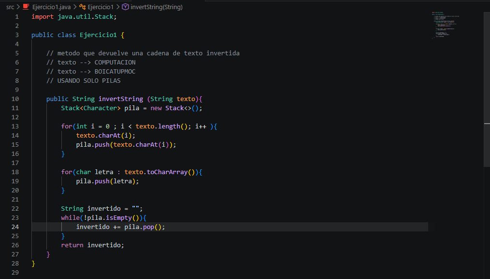
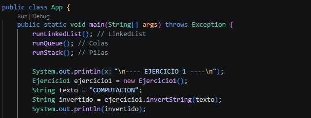
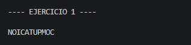
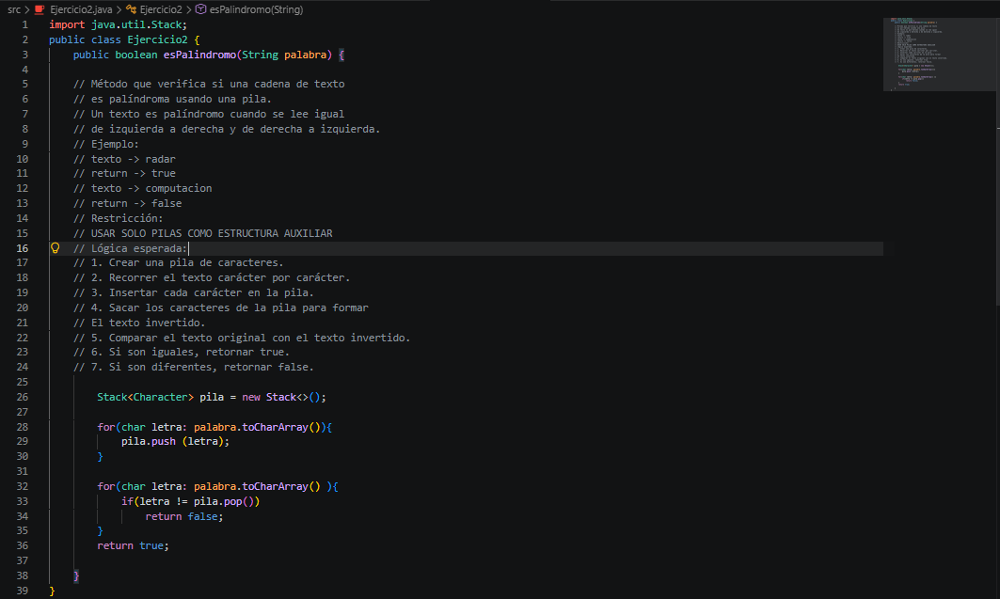
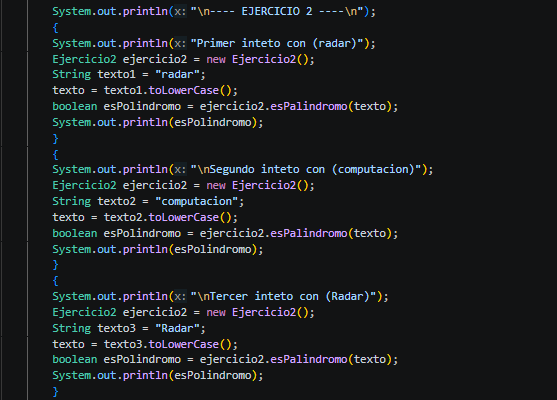
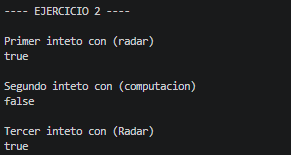

# Práctica: Estructuras Dinamicas Lineales

## Datos del Estudiante
- **Nombre:** Edwin Patricio Pintado Reinoso
- **Curso:** Grupo 1
- **Fecha:** 03/06/2026

---

## 1. Implementacion de Estructuras Dinamicas Lineales

**Fecha:** 08/06/2026

**Descripción:** En estas practicas se desarrollo la creacion de las siguientes listas, su funcionalidad, implementacion, y los metodos correspondientes para cada una. 

Estas son las estructuras dinamicas lineales:
- Listas enlazadas con LinkedList
- Pilas con Stack y Deque
- Colas con queue

---

**Fecha:** 08/06/2026

Ejercicio1: invertir el String "COMPUTACION", solo usando pilas 

Imagenes Ejercio1:

- metodo

- app

- ejecución 

---

**Fecha:** 10/06/2026

Ejercicio2: Crear un metodo en el cual comprube si una palabra es polindromo solo usando pilas 

- Palabra1: "radar"
- Palabra2: "computacion"
- Palabra propia para validar con mayusculas: "Radar"

Imagenes Ejercio2:

- metodo

- app

- ejecución 

